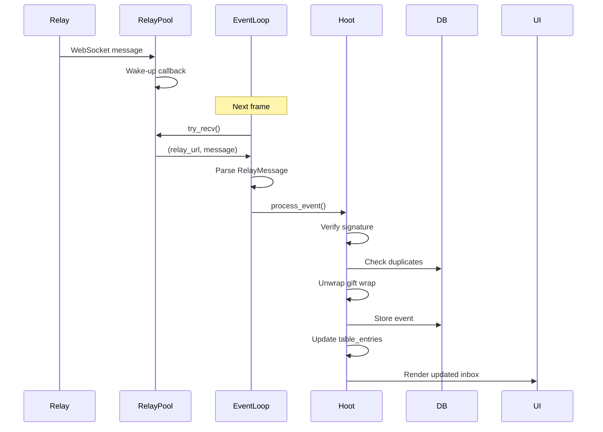
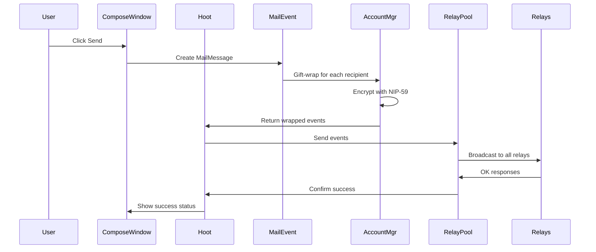
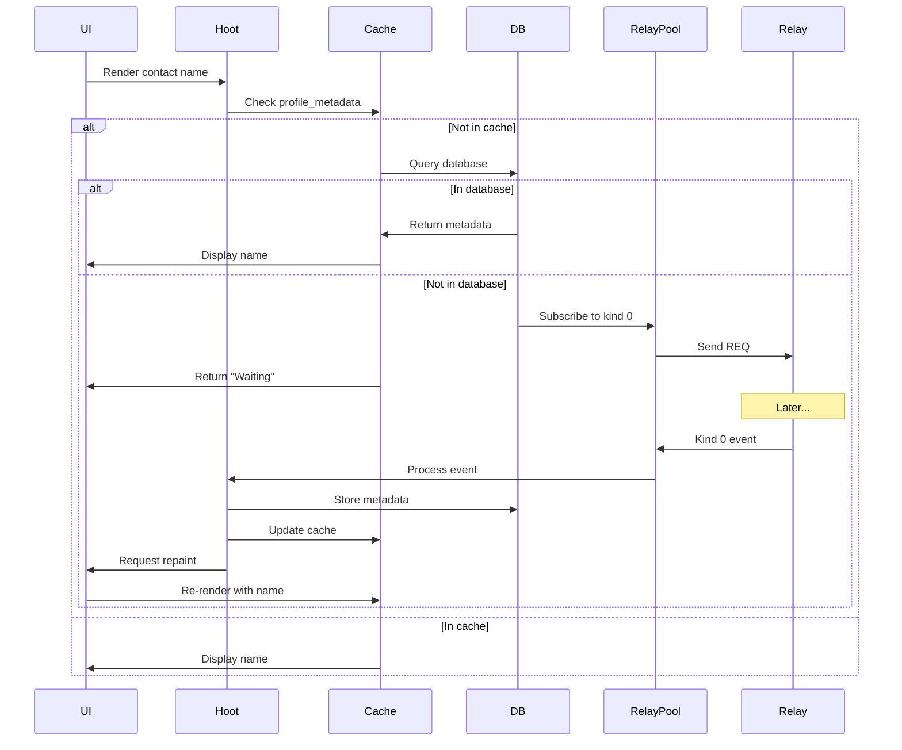

This page documents Hoot's application structure, including the main `Hoot` struct, event loop architecture, threading model, and how data flows through the system.

## The Hoot struct

The `Hoot` struct (src/main.rs:62) is the main application state container that implements the `eframe::App` trait.

### Structure definition

```rust
pub struct Hoot {
    // Navigation and UI state
    pub page: Page,
    pub focused_post: String,
    pub show_trashed_post: bool,
    status: HootStatus,
    state: HootState,
    
    // Core components
    relays: relay::RelayPool,
    events: Vec<nostr::Event>,
    account_manager: account_manager::AccountManager,
    pub active_account: Option<nostr::Keys>,
    pub db: db::Db,
    
    // UI data
    table_entries: Vec<TableEntry>,
    trash_entries: Vec<TableEntry>,
    request_entries: Vec<TableEntry>,
    junk_entries: Vec<TableEntry>,
    profile_metadata: HashMap<String, ProfileOption>,
    pub contacts_manager: ContactsManager,
    drafts: Vec<db::Draft>,
    
    // Background services
    nip05_verifier: nip05::Nip05Verifier,
    nip05_resolver: nip05::Nip05Resolver,
}
```

### State management

The `HootState` struct (src/types.rs:40) stores UI component states:

```rust
pub struct HootState {
    pub add_account_window: HashMap<egui::Id, AddAccountWindowState>,
    pub compose_window: HashMap<egui::Id, ComposeWindowState>,
    pub onboarding: OnboardingState,
    pub settings: SettingsState,
    pub unlock_database: UnlockDatabaseState,
    pub contacts: ContactsPageState,
    pub requests: RequestsPageState,
    pub search: SearchState,
}
```

This design allows:
- Multiple compose windows tracked by unique IDs
- Multiple add account dialogs
- Per-page state persistence
- Clean separation of concerns

### Application status

The `HootStatus` enum (src/types.rs:67) tracks initialization state:

```rust
pub enum HootStatus {
    PreUnlock,        // Initial state, no database access
    WaitingForUnlock, // Database password prompt shown
    Initializing,     // Loading accounts, events, contacts
    Ready,            // Fully initialized and running
}
```

This ensures proper initialization order and prevents operations before the database is unlocked.

## Initialization flow

The application initialization follows a strict sequence (src/main.rs:352):

### 1. Application creation

```rust
fn new(_cc: &eframe::CreationContext<'_>) -> Self {
    // Create storage directory
    let storage_dir = eframe::storage_dir(STORAGE_NAME).unwrap();
    std::fs::create_dir_all(&storage_dir).unwrap();
    
    // Initialize database (locked)
    let db_path = storage_dir.join("hoot.db");
    let db = db::Db::new(db_path).unwrap();
    
    // Check if first run
    let page = match std::fs::exists(storage_dir.join("done")) {
        Ok(true) => Page::Unlock,
        Ok(false) => Page::Onboarding,
        Err(e) => panic!("Setup check failed: {}", e),
    };
    
    // Initialize with PreUnlock status
    Self {
        status: HootStatus::PreUnlock,
        page,
        // ... initialize other fields
    }
}
```

### 2. Pre-unlock phase

In the `PreUnlock` state (src/event_processing.rs:42):

```rust
if app.status == HootStatus::PreUnlock {
    app.status = HootStatus::WaitingForUnlock;
    
    // Connect to default relays
    app.relays.add_url("wss://relay.chakany.systems", wake_up.clone());
    app.relays.add_url("wss://talon.quest", wake_up.clone());
    
    // Start keepalive
    app.relays.keepalive(wake_up);
    return;
}
```

### 3. Database unlock

User enters password in unlock screen (src/ui/unlock_database.rs), then:

```rust
db.unlock_with_password(password)?;
app.status = HootStatus::Initializing;
```

### 4. Initialization phase

Once unlocked (src/event_processing.rs:63):

```rust
if app.status == HootStatus::Initializing {
    // Load keys from secure storage
    app.account_manager.load_keys(&app.db)?;
    
    // Database maintenance
    app.db.purge_deleted_events()?;
    app.db.purge_expired_trash(now)?;
    
    // Load messages
    app.table_entries = app.db.get_top_level_messages()?;
    app.refresh_trash();
    app.refresh_requests();
    app.refresh_junk();
    
    // Setup subscriptions
    if !app.account_manager.loaded_keys.is_empty() {
        app.update_gift_wrap_subscription();
        app.contacts_manager.load_from_db(&app.db, &mut app.profile_metadata)?;
    }
    
    app.refresh_drafts();
    app.status = HootStatus::Ready;
}
```

### 5. Ready state

Application is now fully operational and processes events normally.

## Event loop

Hoot's event loop follows egui's immediate-mode pattern with two main functions:

### update_app()

Processes background events and updates state (src/event_processing.rs:33):

```rust
pub fn update_app(app: &mut Hoot, ctx: &egui::Context) {
    let ctx = ctx.clone();
    let wake_up = move || {
        ctx.request_repaint();
    };
    
    // Handle initialization states
    if app.status == HootStatus::PreUnlock { /* ... */ }
    if app.status == HootStatus::WaitingForUnlock { /* ... */ }
    if app.status == HootStatus::Initializing { /* ... */ }
    
    // Main event loop (Ready state)
    app.relays.keepalive(wake_up);
    try_recv_relay_message(app);
    app.contacts_manager.process_image_queue(&ctx);
    app.nip05_verifier.process_queue(&app.db);
    app.nip05_resolver.process_queue();
}
```

### render_app()

Renders UI based on current state (src/main.rs:274):

```rust
fn render_app(app: &mut Hoot, ctx: &egui::Context) {
    // Render floating windows
    render_add_account_windows(app, ctx);
    render_compose_windows(app, ctx);
    
    // Render main UI
    match app.page {
        Page::Unlock => { /* no sidebar */ }
        Page::Onboarding => { /* no sidebar */ }
        _ => render_left_panel(app, ctx),
    }
    
    render_search_bar(app, ctx);
    
    // Render central content
    egui::CentralPanel::default().show(ctx, |ui| {
        match app.page {
            Page::Inbox => ui::inbox::render(app, ui),
            Page::Post => ui::thread_view::render(app, ui),
            Page::Drafts => ui::drafts_page::render(app, ui),
            // ... other pages
        }
    });
}
```

### Frame timing

Every frame:

1. `update_app()` processes relay messages, images, NIP-05 verifications
2. `render_app()` draws UI with updated data
3. egui submits draw commands to GPU
4. Application sleeps until next event (wake-up callback or timer)

This ensures the UI is responsive while minimizing CPU usage.

## Threading model

Hoot uses multiple threading strategies for different tasks:

### Main UI thread

Runs immediate-mode egui with synchronous operations:

- UI rendering
- Database queries (rusqlite is synchronous)
- Event processing
- State updates

```rust
impl eframe::App for Hoot {
    fn update(&mut self, ctx: &egui::Context, _frame: &mut eframe::Frame) {
        event_processing::update_app(self, ctx);
        render_app(self, ctx);
    }
}
```

### WebSocket connections

Use `ewebsock` with wake-up callbacks:

```rust
let wake_up = move || {
    ctx.request_repaint();
};

let (sender, receiver) = ewebsock::connect_with_wakeup(
    relay_url,
    ewebsock::Options::default(),
    wake_up
)?;
```

When a message arrives:
1. WebSocket thread receives data
2. Calls wake-up callback
3. egui schedules repaint
4. Main thread processes message in next frame

### Profile image fetching

Background threads prevent UI blocking (src/image_loader.rs):

```rust
std::thread::spawn(move || {
    let client = reqwest::blocking::Client::new();
    let response = client.get(&url).send()?;
    let bytes = response.bytes()?;
    
    // Send result back to main thread
    tx.send((pubkey, bytes)).ok();
});
```

Main thread checks for completed images each frame:

```rust
app.contacts_manager.process_image_queue(&ctx);
```

### Gift-wrap operations

Use `pollster` to block on async Nostr SDK operations:

```rust
pub fn unwrap_gift_wrap(&self, event: &Event) -> Result<UnwrappedGift> {
    pollster::block_on(async {
        // Async Nostr SDK operations
        extract_rumor(&keys, event).await
    })
}
```

This keeps the main thread synchronous while using async crypto libraries.

## Data flow

Data flows through Hoot in several key patterns:

### 1. Receiving messages



### 2. Sending messages



### 3. Profile metadata loading



### 4. Gift-wrap subscription

When accounts are loaded (src/main.rs:431):

```rust
pub fn update_gift_wrap_subscription(&mut self) {
    let public_keys: Vec<nostr::PublicKey> = self
        .account_manager
        .loaded_keys
        .iter()
        .map(|k| k.public_key())
        .collect();
    
    // Subscribe to gift wraps tagged with our pubkeys
    let filter = nostr::Filter::new()
        .kind(nostr::Kind::GiftWrap)
        .custom_tag(
            nostr::SingleLetterTag { character: nostr::Alphabet::P, uppercase: false },
            public_keys,
        );
    
    let mut gw_sub = relay::Subscription::default();
    gw_sub.filter(filter);
    
    self.relays.add_subscription(gw_sub)?;
}
```

This ensures we receive all gift-wrapped messages addressed to our accounts.

## Key methods

### refresh_* methods

Update UI data from database:

```rust
fn refresh_drafts(&mut self) {
    match self.db.get_drafts() {
        Ok(drafts) => self.drafts = drafts,
        Err(e) => error!("Failed to load drafts: {}", e),
    }
}

fn refresh_trash(&mut self) {
    match self.db.get_trash_messages() {
        Ok(entries) => self.trash_entries = entries,
        Err(e) => error!("Failed to load trash: {}", e),
    }
}
```

### resolve_name()

Resolves display names with fallback priority (src/main.rs:461):

```rust
fn resolve_name(&self, pubkey: &str) -> Option<String> {
    // 1. Check contacts for petname (user-defined)
    if let Some(petname) = self.contacts_manager.find_petname(pubkey) {
        return Some(petname.to_string());
    }
    
    // 2. Check profile metadata for display_name
    if let Some(ProfileOption::Some(meta)) = self.profile_metadata.get(pubkey) {
        if let Some(display_name) = &meta.display_name {
            return Some(display_name.clone());
        }
        
        // 3. Fall back to metadata name field
        if let Some(name) = &meta.name {
            return Some(name.clone());
        }
    }
    
    // 4. No name available, caller shows truncated pubkey
    None
}
```

## Storage locations

Hoot stores data in platform-specific directories:

### Application data

```rust
#[cfg(debug_assertions)]
pub const STORAGE_NAME: &str = "systems.chakany.hoot-dev";

#[cfg(not(debug_assertions))]
pub const STORAGE_NAME: &str = "systems.chakany.hoot";

let storage_dir = eframe::storage_dir(STORAGE_NAME).unwrap();
```

Resolves to:
- **Linux**: `~/.local/share/systems.chakany.hoot/`
- **macOS**: `~/Library/Application Support/systems.chakany.hoot/`
- **Windows**: `%APPDATA%\systems.chakany.hoot\`

### Database file

```rust
let db_path = storage_dir.join("hoot.db");
```

The database is encrypted with SQLCipher using a user-provided password.

### Key storage

Private keys are stored in platform keychains:
- **macOS**: Keychain API via `security-framework` crate
- **Windows**: Credential Manager
- **Linux**: Secret Service API (with file-based fallback)

## Error handling

Hoot uses Rust's `Result` type with the `anyhow` crate for flexible error handling:

```rust
use anyhow::Result;

fn process_event(&mut self) -> Result<()> {
    // Operations that can fail
    self.db.store_event(event)?;
    Ok(())
}
```

Errors are logged and handled gracefully without crashing:

```rust
match app.db.get_top_level_messages() {
    Ok(msgs) => app.table_entries = msgs,
    Err(e) => error!("Could not fetch messages: {}", e),
}
```

## Performance considerations

### Wake-up callbacks

Minimize unnecessary repaints:

```rust
let wake_up = move || {
    ctx.request_repaint();
};
```

Repaints only trigger when:
- WebSocket message received
- Image download completed
- User interaction
- Timer expires (keepalive, reconnect)

### Batched operations

Process all available messages in one frame:

```rust
while let Some((relay_url, message)) = app.relays.try_recv() {
    process_message(app, &relay_url, &message);
}
```

### Lazy loading

Profile metadata and images load on-demand:

```rust
if !profile_metadata.contains_key(pubkey) {
    profile_metadata.insert(pubkey.clone(), ProfileOption::Waiting);
    request_metadata_from_relay(pubkey);
}
```

## Next steps

<CardGroup cols={2}>
  <Card title="Database schema" href="/architecture/database" icon="table">
    Explore the database schema and query patterns
  </Card>
  <Card title="Relay system" href="/architecture/relay-system" icon="network-wired">
    Learn about Nostr relay communication and subscriptions
  </Card>
</CardGroup>