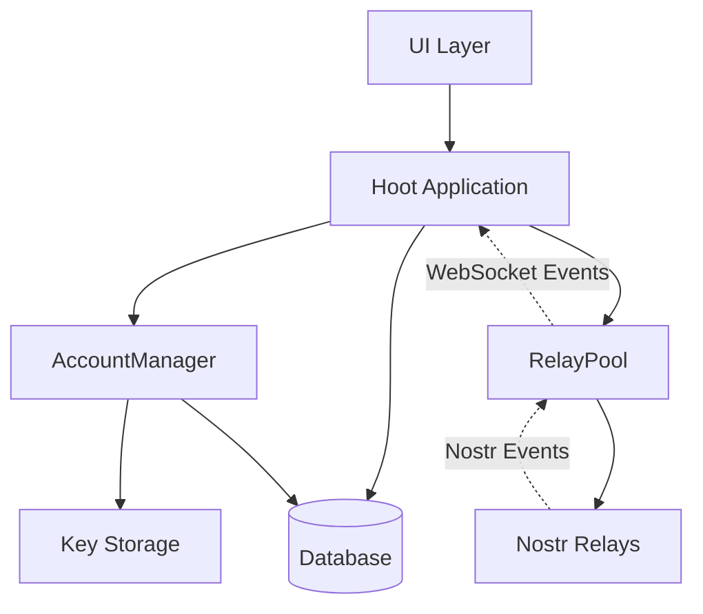

Hoot is a desktop email/messaging client built on the Nostr protocol using Rust and egui. It provides email-like functionality over Nostr, featuring a native GUI for sending/receiving messages, managing contacts, and viewing profiles.

## Core components

Hoot's architecture is built around four main components that work together to provide a seamless email experience over the Nostr protocol:

<CardGroup cols={2}>
  <Card title="RelayPool" icon="network-wired">
    Manages WebSocket connections to multiple Nostr relays with automatic reconnection and keepalive pings
  </Card>
  <Card title="AccountManager" icon="key">
    Handles Nostr keypairs, secure key storage, and NIP-59 gift-wrap encryption/decryption
  </Card>
  <Card title="Database" icon="database">
    SQLite database with SQLCipher encryption for storing events, messages, and profile metadata
  </Card>
  <Card title="UI" icon="desktop">
    Immediate-mode GUI built with egui, featuring page-based navigation and floating compose windows
  </Card>
</CardGroup>

## Technology stack

Hoot is built with the following core technologies:

- **Rust**: Systems programming language for performance and memory safety
- **egui**: Immediate-mode GUI framework for native desktop interfaces
- **Nostr SDK**: Protocol implementation via the `nostr` crate (v0.37.0)
- **SQLite + SQLCipher**: Encrypted local database for event storage
- **ewebsock**: WebSocket library for relay connections

## Component interactions



## Relay system

The relay system manages connections to multiple Nostr relays and handles all network communication.

### RelayPool

The `RelayPool` (src/relay/pool.rs:13) manages multiple relay connections:

- Maintains a `HashMap<String, Relay>` of active connections
- Automatic reconnection every 5 seconds for disconnected relays
- Keepalive pings every 30 seconds to maintain connections
- Tracks subscriptions and authentication state per relay

```rust
pub struct RelayPool {
    pub relays: HashMap<String, Relay>,
    pub subscriptions: HashMap<String, Subscription>,
    last_reconnect_attempt: Instant,
    last_ping: Instant,
    pending_auth_subscriptions: HashMap<String, Vec<String>>,
}
```

### Relay

Individual relay connections (src/relay/mod.rs:28) use WebSocket communication:

- `ewebsock` library for WebSocket connections with wake-up callbacks
- Three connection states: `Connecting`, `Connected`, `Disconnected`
- Authentication state tracking per relay
- Automatic status updates based on WebSocket events

### Message types

**Client messages** (outbound to relays):
- `Req`: Subscribe to events matching filters
- `Event`: Publish a new event
- `Auth`: Authenticate with relay (NIP-42)
- `Close`: Close a subscription

**Relay messages** (inbound from relays):
- `Event`: Received event matching subscription
- `OK`: Command acceptance/rejection
- `EOSE`: End of stored events
- `Notice`: Relay notification
- `Closed`: Subscription closed by relay
- `Auth`: Authentication challenge

## Account management

The `AccountManager` (src/account_manager.rs) handles cryptographic operations and key management.

### Key features

- **Multiple account support**: Load and manage multiple Nostr keypairs
- **Secure storage**: Platform-specific key storage (Keychain on macOS, Credential Manager on Windows, Secret Service on Linux)
- **Gift-wrap encryption**: Automatic encryption/decryption of NIP-59 gift-wrapped messages
- **Authentication**: Create NIP-42 AUTH events for relay authentication

### Gift-wrap handling

Gift wraps (NIP-59) provide privacy for direct messages:

1. **Sending**: `MailMessage::to_events()` creates one gift-wrapped event per recipient
2. **Receiving**: `AccountManager::unwrap_gift_wrap()` decrypts incoming gift wraps
3. **Storage**: Inner "rumor" events are stored; outer gift wraps are tracked for deletion

## Database

The database layer (src/db/mod.rs) provides persistent storage with encryption.

### Schema design

**Events table**:
- Stores raw Nostr events as JSON blobs
- Virtual columns extracted from JSON for efficient querying
- Indexes on `id`, `pubkey`, `kind`, and `created_at`

**Profile metadata table**:
- Caches Nostr metadata (kind 0) events
- Includes display name, avatar URL, NIP-05 identifier
- Updated only when newer metadata is received

**Gift wrap mapping**:
- Maps outer gift wrap IDs to inner rumor IDs
- Tracks recipients for proper deletion handling

### Key features

- **Encryption**: SQLCipher encryption with user-provided password
- **Migrations**: Schema versioning via `rusqlite_migration`
- **Thread reconstruction**: Recursive CTEs to build email-style threads
- **Deletion tracking**: Soft deletes with expiration for trash

```rust
pub struct Db {
    pub(crate) connection: Connection,
}
```

## UI system

The UI is built with egui's immediate-mode paradigm (src/ui/).

### Page-based navigation

The `Page` enum (src/types.rs:18) defines main views:

- Inbox, Drafts, Starred, Archived, Trash
- Requests (messages from non-contacts)
- Junk (spam folder)
- Contacts, Settings
- Onboarding flow

### Component architecture

**Main panels**:
- Left sidebar: Navigation and account selector
- Central panel: Content area (inbox, thread view, settings, etc.)
- Floating windows: Compose, add account

**State management**:
```rust
pub struct HootState {
    pub add_account_window: HashMap<egui::Id, AddAccountWindowState>,
    pub compose_window: HashMap<egui::Id, ComposeWindowState>,
    pub onboarding: OnboardingState,
    pub settings: SettingsState,
    // ...
}
```

Multiple compose windows can be open simultaneously, each tracked by a unique `egui::Id`.

### Rendering pattern

Hoot follows egui's immediate-mode pattern:

1. `update_app()` (src/event_processing.rs:33): Process events, update state
2. `render_app()` (src/main.rs:274): Render UI based on current state
3. Every frame: Check relay messages, process image queue, update UI

## Mail events

Hoot uses custom kind 2024 events for mail messages (src/mail_event.rs).

### MailMessage structure

```rust
pub struct MailMessage {
    pub to: Vec<String>,      // Recipient public keys
    pub cc: Vec<String>,      // CC recipients
    pub bcc: Vec<String>,     // BCC recipients
    pub subject: String,      // Email subject
    pub body: String,         // Message body
    pub parent_events: Vec<String>, // Thread parent IDs
}
```

### Privacy features

- **Gift-wrap encryption**: All mail events are wrapped using NIP-59
- **One event per recipient**: Each recipient gets their own gift-wrapped copy
- **BCC privacy**: BCC recipients are not visible to other recipients
- **Thread references**: Parent event IDs enable email-style threading

## Event flow

### Receiving messages

1. RelayPool receives WebSocket event from relay
2. `try_recv_relay_message()` (src/event_processing.rs:24) processes raw message
3. `process_event()` (src/event_processing.rs:283) handles parsed event:
   - Verify event signature
   - Check for duplicates and deletions
   - Unwrap gift wraps if recipient key available
   - Store in database
   - Update UI state (inbox, profile cache, etc.)

### Sending messages

1. User composes message in `ComposeWindow`
2. `MailMessage::to_events()` creates gift-wrapped events for each recipient
3. `RelayPool::send()` broadcasts events to all connected relays
4. Relays return `OK` message indicating acceptance/rejection

### Profile metadata

1. `get_profile_metadata()` checks local cache
2. If not cached, returns `ProfileOption::Waiting` and triggers relay request
3. Relay sends kind 0 (metadata) event
4. Update `profile_metadata` HashMap and database
5. Trigger UI repaint to show updated profile

## Security considerations

- **Database encryption**: SQLCipher protects local data at rest
- **Secure key storage**: Platform keychain integration prevents key exposure
- **Event verification**: All events verified with Nostr signatures
- **Gift-wrap privacy**: NIP-59 ensures message content privacy
- **Deletion handling**: Proper scoping prevents unauthorized deletions

## Performance optimizations

- **Immediate-mode UI**: egui's immediate-mode design provides responsive rendering
- **Wake-up callbacks**: WebSocket connections trigger repaints only when needed
- **Profile caching**: Metadata cached in-memory and database to reduce relay requests
- **Image loading**: Background threads prevent UI blocking
- **Virtual columns**: SQLite generated columns enable fast queries without parsing JSON

## Next steps

<CardGroup cols={2}>
  <Card title="Application structure" href="/architecture/application-structure" icon="diagram-project">
    Learn about the Hoot struct, event loop, and threading model
  </Card>
  <Card title="Database schema" href="/architecture/database" icon="table">
    Explore the database schema and query patterns
  </Card>
</CardGroup>